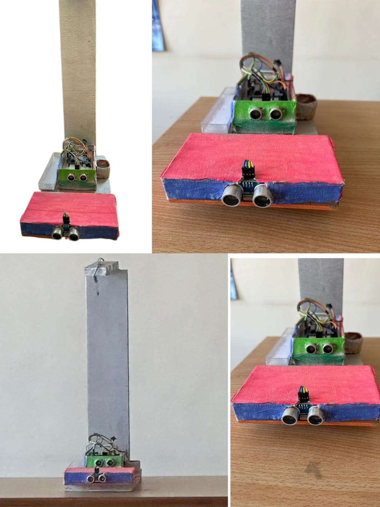
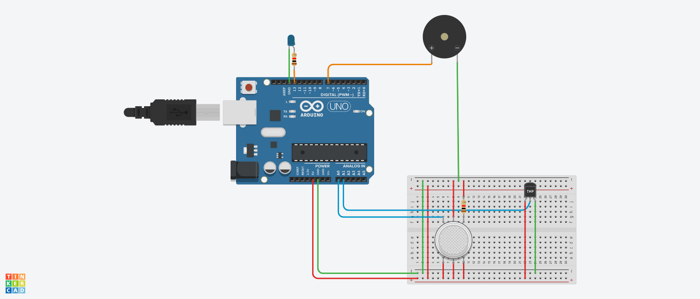

# Smart Lighting Automation System

## 📌 Overview
This project is based on Arduino and focuses on automating lighting systems using sensors. It includes a light sensor module for automatic control and a protection mechanism to prevent damage to electrical devices.

## ⚙️ Components Used
- Arduino board
- LDR (Light Dependent Resistor)
- Relay module
- LED / Lamp
- Resistors
- Breadboard & connecting wires

## 💡 Features
- Automatically turns lights ON/OFF based on ambient light
- Protects devices from overload or unsafe conditions
- Reduces manual effort and energy wastage

## 📂 Files
- [LAMP___PROTECTOR.ino](LAMP___PROTECTOR.ino)

## 🚀 Working Principle
1. LDR senses surrounding light intensity  
2. Arduino processes the signal  
3. Relay switches the lamp ON/OFF automatically  
4. Protection system prevents damage during abnormal conditions  

## 📸 Project Images

## 🎥 Working Video
[▶️ Watch Video](working.mp4)

## 🎯 Future Improvements
- IoT-based remote control
- Mobile app integration
- Smart scheduling system
